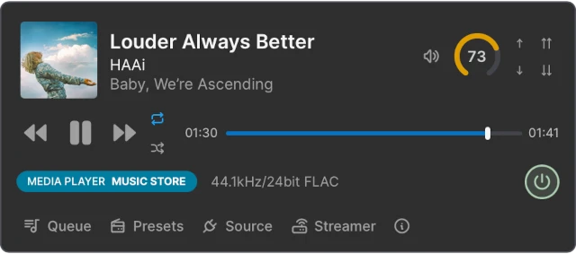

#  PunyTunes

[PunyTunes](https://punytunes.app) is a desktop system tray application for controlling
[StreamMagic music streamers](https://www.cambridgeaudio.com/row/en/products/streammagic).

Volume control requires the streamer to be in Pre-Amp or Control Bus mode. PunyTunes also supports
Hegel amplifiers.

> [!NOTE]
> This code is "source available". You're welcome to use it in any way allowed by the
> [license](./LICENSE). The application however is **not currently under active development**. Any
> Issues or Pull Requests may not be responded to, but you can always try.

## Screenshots

See the [PunyTunes application website](https://punytunes.app) for more details.

### In the MacOS System Tray

PunyTunes is a system tray application. You activate its display by clicking on the PunyTunes icon
in the system tray.


### Compact View

The default compact view shows what is currently playing on the streamer, along with transport
controls and (when available) volume controls.



### Detail View

More details can be shown for the Queue, Presets, Sources, and Streamer. The following shows the
Queue details.


> [!TIP]
> There are two additional detail panes only visible using hotkeys. `Shift` + `L` will show a Logs
> pane, and `Shift` + `P` will show a streamer Payloads pane.

## Technology Stack

PunyTunes is a [Tauri](https://tauri.app/) application using [Rust](https://www.rust-lang.org/) for
the back-end and [Svelte](https://svelte.dev/) for the UI.

## Installation

### System Pre-Requisites

First follow the [Tauri pre-requisite installation](https://v2.tauri.app/start/) instructions.
Follow the requirements for a desktop application only (PunyTunes does not target mobile) for your
platform of choice (MacOS, Windows, or Linux).

In short, you will need **Rust** and **Node.js** installed.

PunyTunes development also uses [pnpm](https://pnpm.io/installation) so you should install that too.

### Installing PunyTunes

Clone the repository and install its dependencies.

```bash
git clone https://github.com/mjoblin/punytunes.git
cd punytunes
pnpm install
```

## Local Development

PunyTunes was developed in [Rust Rover](https://www.jetbrains.com/rust/). You can use whatever IDE
you prefer, but the following assumes Rust Rover.

### Configure Rust Rover

Load the PunyTunes project **root directory**, and attach the `src-tauri/Cargo.toml`.

Create a **Run Configuration**. Set the "Command" to `run --no-default-features` and the "Working
Directory" to `src-tauri/`.

### Run Locally

In the terminal, run the following from the project root:

```
pnpm tauri dev
```

This will start a full instance of PunyTunes, so you should see the icon in your system tray.

(If PunyTunes doesn't find your streamer on startup, try selecting the Streamer tab in the UI and
clicking the "Find" button).

Then, in Rust Rover, **start the Run Configuration**. This requires that `pnpm tauri dev` is already
running (see above). This will start a **second instance of PunyTunes** which will result in a
second PunyTunes icon appearing in your system tray. **This is the instance you will be
developing**.

Now, any changes you make to the Svelte UI code from Rust Rover will live-update in the second
instance of the application.

#### Floating Window

PunyTunes is a system tray application. During development it's often easier to have the application
appear in an always-visible floating window instead. To do that, copy
`src-tauri/tauri.conf.FLOATING.json` to `src-tauri/tauri.conf.json` before starting the Run
Configuration. To revert back to the normal system tray behavior, copy
`src-tauri/tauri.conf.SYSTEM_TRAY.json` to `src-tauri/tauri.conf.json`.

## Building

PunyTunes has been built successfully for MacOS and Windows, and for Linux with some small tweaks.
For detailed build instructions refer to the [Tauri build documentation](https://v2.tauri.app/distribute/).

On MacOS you may first need to run this:

```
rustup target add x86_64-apple-darwin
```

Then build the application from the project root:

```
pnpm tauri build --target universal-apple-darwin
```

> [!WARNING]
> The first time you build, you will get an error telling you to update `"com.CHANGE_THIS"` in
> `src-tauri/tauri.conf.json`. See the
> [Tauri configuration documentation](https://v2.tauri.app/reference/config/#identifier) for
> details.

If the build fails with `"failed to bundle project: error running bundle_dmg.sh`, try building a
second time.

You will see warnings during the build. These should not prevent the build from succeeding, and are
largely due to the code having some Windows-specific code paths which are not followed on the Mac.
Newer Rust compiler versions might also flag additional warnings.

For Windows, build the application with this from the project root:

```
pnpm tauri build
```

The built files will be written to a platform-specific directory under `src-tauri/target/`.

## Brief Code Overview

The Rust back-end handles the communication with the StreamMagic streamer (and Hegel amplifiers).
This code lives under `src-tauri/src/` with `main.rs` being the entry point.

The Svelte UI handles the web view. This code lives under `src/` with `App.svelte` being the
entry point.

Communication between the Svelte front-end and the Rust back-end is defined in `src/lib/commands.ts`
and `src-tauri/src/commands.rs`.

Svelte state (for display, including streamer updates received from the back-end) is handled in
`src/lib/state.ts`.

### Tests

Run tests from `src-tauri/` with `cargo test`.

### Types

PunyTunes uses [`ts_rs`](https://docs.rs/ts-rs/latest/ts_rs/) to generate TypeScript types from Rust
types.

TypeScript types are generated by `cargo test` and are stored under `src/types/generated/`. 
